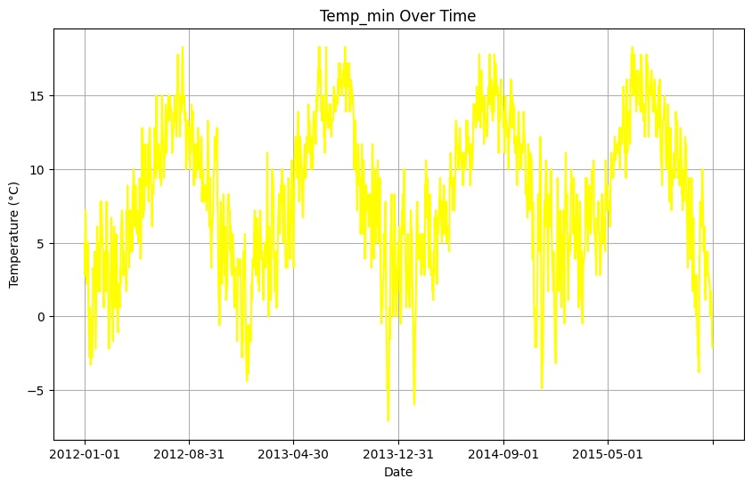

# RNN for Weather Prediction
The main objective of this project is to utilize TensorFlow's functionalities, such as the Functional API, custom models, callbacks, and plotting models, to build an intelligent system for weather prediction using RNNs.

## What is an RNN?

A Recurrent Neural Network (RNN) is a type of artificial neural network designed to handle sequential data. It is particularly well-suited for tasks involving time-series data or natural language processing (NLP). RNNs have recurrent connections that allow them to capture temporal dependencies in the data.

## Dataset Description
This project aims to predict weather conditions (drizzle, rain, sun, snow) based on various weather parameters using Recurrent Neural Networks (RNNs). The dataset used for this project is sourced from [Kaggle](https://www.kaggle.com/datasets/ananthr1/weather-prediction), consisting of a CSV file with the following columns:

- **precipitation**
- **temp_max**
- **temp_min**
- **wind**

The dataset provides historical weather data, including precipitation, maximum and minimum temperatures, and wind speed. The goal is to predict the weather condition (drizzle, rain, sun, snow) based on these parameters.

  

  

  

  

## Model Architecture

The RNN model is designed with a sequence length of 7, meaning it takes the data of the past 7 days to predict the weather condition for the next day. The model architecture includes LSTM layers followed by dropout layers to prevent overfitting.

  

## Training and Evaluation

The model is trained using the provided dataset, and the performance is evaluated on a separate test dataset. The Mean Squared Error (MSE) is used as the loss function during training. 

The training loss per epoch is visualized below:

  

## Conclusion

This project demonstrates the effectiveness of using RNNs for weather prediction tasks. By leveraging TensorFlow's capabilities, we've built a robust model capable of predicting weather conditions based on historical data.
